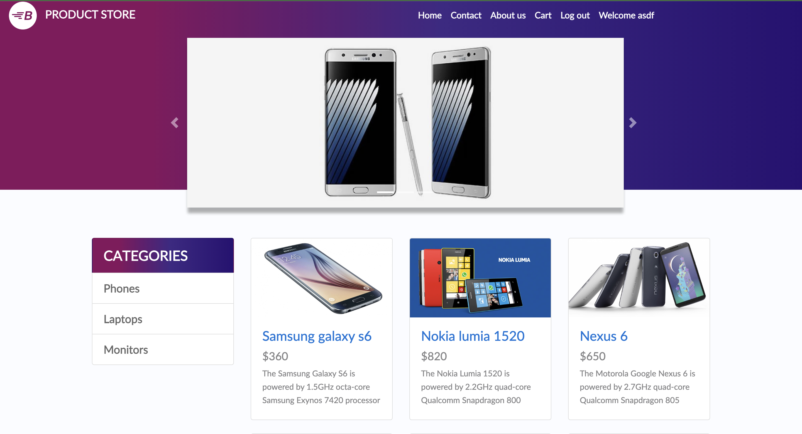
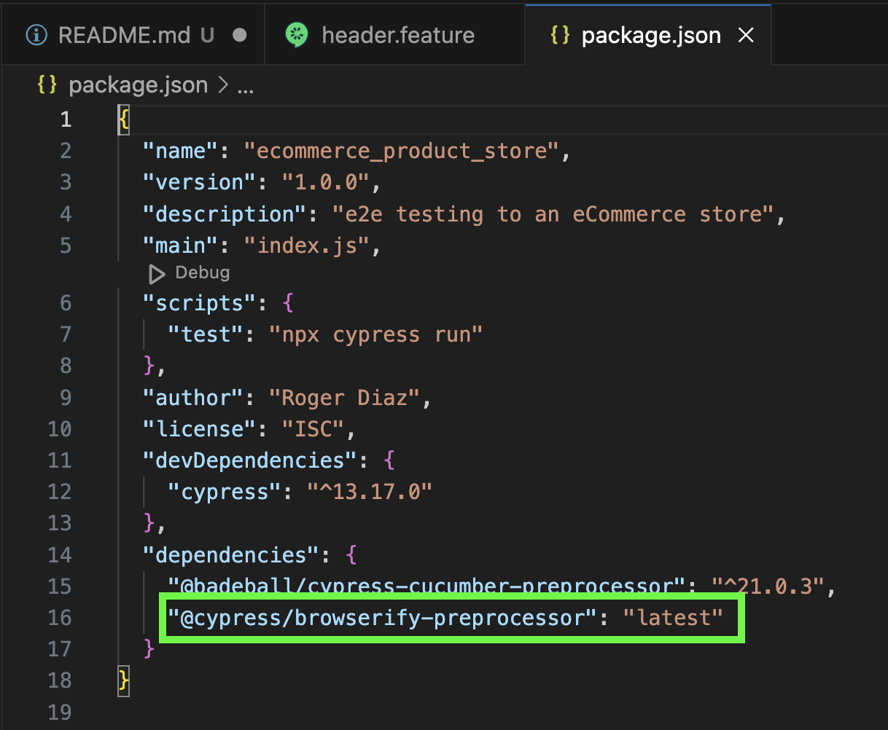
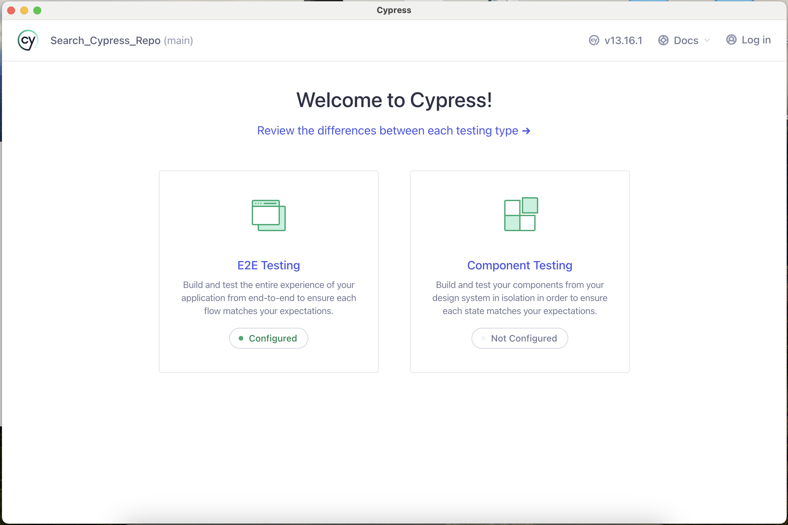
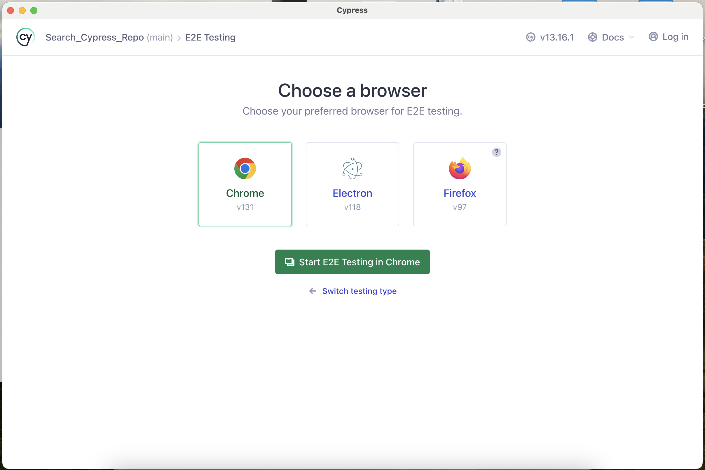
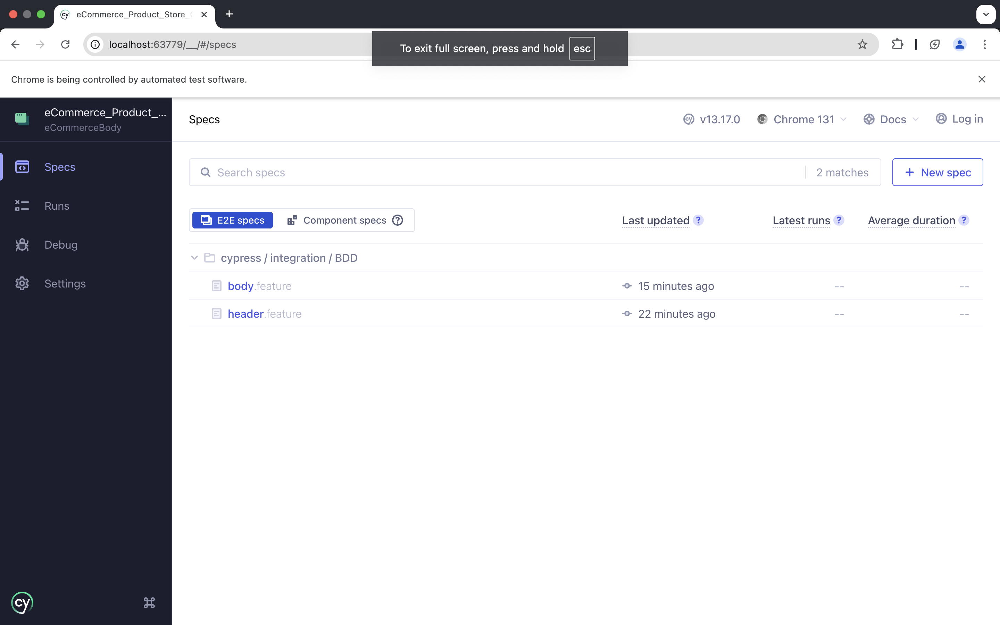
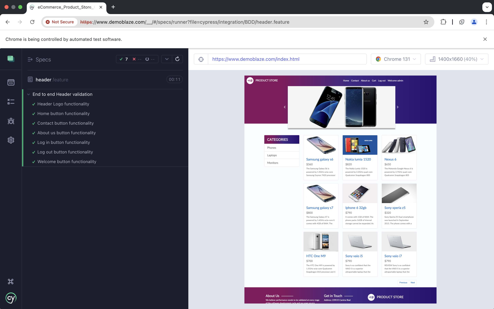
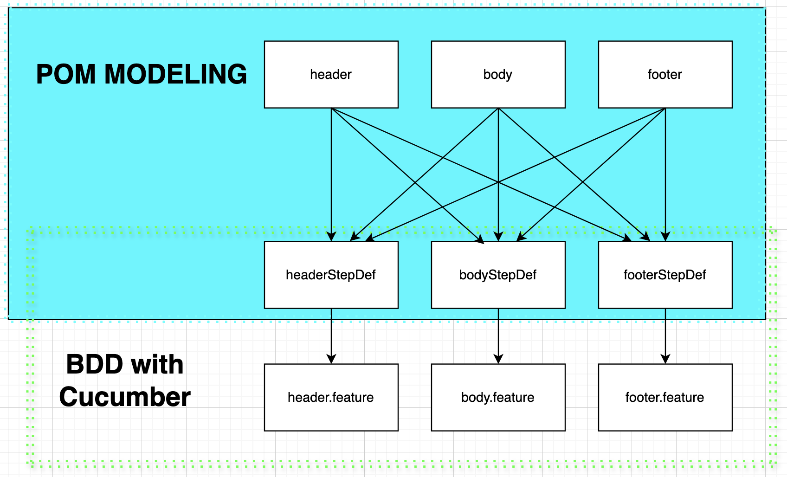
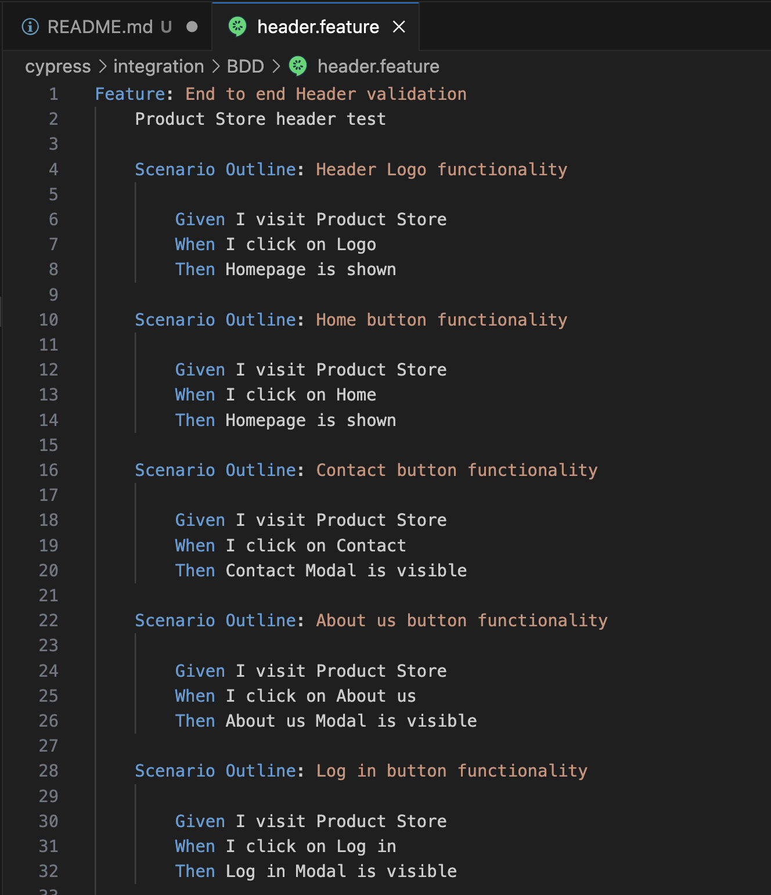

# Functional Testing of a eCommerce site with Cypress

## Validation of eCommerce site

The following project is a test suite used to verify the functionality of the different parts of the eCommerce page [Product Store](https://www.demoblaze.com/index.html).

<p align="center"></p>

Click on this to watch the video of a purchase test case.
[](https://youtu.be/mIirWyaVQU0)

## How to install and run this repo

Let's download and install node.js from the official page.
In your bash profile add the variable path:

```console
export PATH=$PATH:/usr/local/bin
```

Open a terminal in the directory of the project and run the following to create a project with Package.json

```console
$ npm -i init
```

Now, let's install Cypress with the following command.

```console
$ npm install cypress --save-dev
```

In order to use Cucumber, we have to install the following things based on this link: https://github.com/badeball/cypress-cucumber-preprocessor

```console
$ npm install @badeball/cypress-cucumber-preprocessor
```

Just in case, verify that you have "@cypress/browserify-preprocessor": "latest" in your **package.json** file. If not, please add it.

<p align="center"></p>
Then, run the following command since "@cypress/browserify-preprocessor" couldn't be installed although you already installed Cucumber.

```console
$ npm install
```

So now, let's the action begin!
Run this command to open the Cypress Test Runner

```console
$ node_modules/.bin/cypress open
```

In this screen click on E2E Testing

<p align="center"></p>

Then you will have to select the browser where the tests are going to run.
You can click on Chrome to start.

<p align="center"></p>

In the following screen, you will see the test suites to run. You can select the one you want to try and it will start it's execution.

<p align="center"></p>

At the left side you will see the list of test cases and the status of each one.

<p align="center"></p>

## Programming structure used

So if you want to know more about the structure of the project and the technologies used in this project, I can tell you here...

### POM Modeling

POM Modeling is a programming structure where all the elements of a page and their actions are gathered in a class that you can reuse in all your test steps.

In the following diagram you can see the way I implemented POM modeling in this project

<p align="center"></p>
In this case, searchStepDef.js consume the functions from the class search.js
search.js contains all the elements and actions that are going to be used for all the test cases.

### Cucumber

Cucumber is a tool to automate software tests by implementing the BDD methodology. So you basically are going to write a narrative flow for each test case and that will be executed in the runtime.

Here you can see one Cucumber test case.

<p align="center"></p>
By using Given, When and Then I can call the functions from searchStepDef.js in the right order to execute a test. 
This is an easier way to understand what a test case is about.
